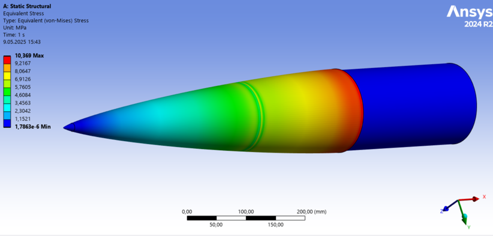
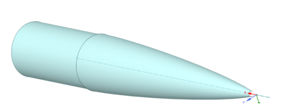
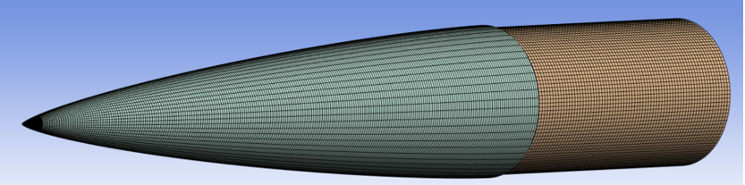
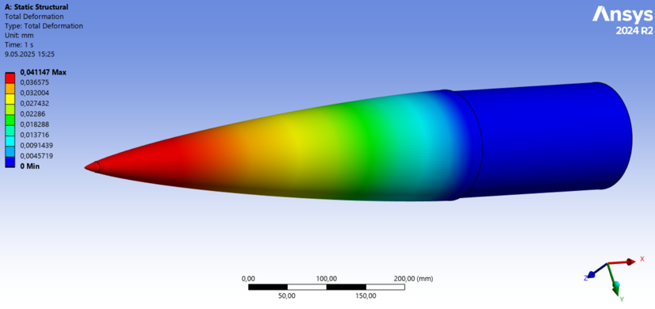

  

<h1 align="center">Nose Cone Structural Analysis Using ANSYS Mechanical</h1>

  Finite Element Analysis (FEA) of a Rocket Nose Cone under Applied Pressure Loading

 

# 🚀 Rocket Nose Cone Finite Element Analysis

**Static Structural Analysis using ANSYS Mechanical**

Finite Element Analysis (FEA) of a rocket nose cone to evaluate structural integrity under aerodynamic loading conditions.

---

# 📖 Project Overview

This repository presents the finite element analysis (FEA) of a rocket nose cone using **ANSYS Workbench / Mechanical**.

The objective of the study is to evaluate the structural integrity of the nose cone under maximum aerodynamic loading conditions obtained from CFD simulations and flight analysis. The analysis includes geometry preparation, material assignment, mesh generation, loading conditions, structural solution and engineering evaluation.

---

# ⚙️ Analysis Information

| Item | Description |
|------|-------------|
| Software | ANSYS Workbench |
| CAD Software | SOLIDWORKS |
| Geometry Editing | ANSYS SpaceClaim |
| Solver | ANSYS Mechanical |
| Analysis Type | Linear Static Structural |
| Solution Method | Sparse Matrix Direct Solver |

---

# 🎯 Objectives

- Evaluate the structural integrity of the rocket nose cone.
- Determine maximum equivalent (von Mises) stress.
- Determine total deformation.
- Verify structural safety under design loads.
- Compare analysis results with allowable material limits.

---

# 🛠 Geometry Preparation

The original nose cone geometry was designed in **SOLIDWORKS**.

Prior to the finite element analysis, pressure holes that do not significantly affect the structural response of the nose cone were removed using **ANSYS SpaceClaim**. This simplification reduced unnecessary geometric complexity while preserving the accuracy of the structural analysis.

---

# 🧱 Material Assignment

The nose cone consists of two different structural materials.

| Component | Material |
|-----------|----------|
| Nose Tip | Aluminum Alloy |
| Internal Bulkhead | Aluminum Alloy |
| Body | Carbon Fiber |
| Shoulder | Carbon Fiber |

Material properties were assigned directly from the **ANSYS Engineering Data Library**.

---

# 📌 Loading & Boundary Conditions

The loading conditions were obtained from previous CFD simulations together with OpenRocket flight simulations.

A design safety factor of **2** was applied to both the aerodynamic pressure and external force.

| Load | Actual Value | Applied Value |
|------|-------------:|--------------:|
| Pressure | 0.03553 MPa | 0.071062 MPa |
| Force | 4228.5 N | 8457 N |

Boundary conditions:

- Fixed Support applied at the shoulder.
- Aerodynamic pressure applied to the nose cone surface.
- External force applied at the nose tip.

---

# 🔷 Mesh Generation

A two-stage meshing strategy was adopted to obtain a high-quality finite element model.

Mesh settings included:

- Program Controlled quadratic elements
- Mechanical mesh method
- Edge sizing for critical regions
- Medium smoothing
- Aggressive error limits

### Mesh Quality

| Criterion | Minimum | Average | Maximum |
|-----------|---------:|---------:|---------:|
| Skewness | 0.006377 | 0.25595 | 0.8074 |
| Element Quality | 0.2907 | 0.76999 | 0.99994 |
| Aspect Ratio | 1.0197 | 2.0394 | 12.505 |

---

# 📈 Analysis Results

## Total Deformation

The total deformation remained extremely small under the applied loading conditions, indicating sufficient structural stiffness.

---

## Equivalent Stress (Von Mises)

The equivalent stress distribution shows that the maximum stress remains well below the allowable limits of the selected materials.

Localized stress concentrations are limited to expected geometric transition regions.

---

# ✅ Structural Assessment

| Property | Carbon Fiber | Aluminum Alloy | Analysis Result | Status |
|----------|-------------:|---------------:|---------------:|:------:|
| Yield Stress | 500–900 MPa | 200–300 MPa | 10.369 MPa | ✅ Safe |
| Total Deformation / Elastic Limit | 0.5–1.5 % | 5–15 % | 0.041147 mm | ✅ Safe |

The obtained results indicate that the rocket nose cone satisfies the structural safety requirements under the applied loading conditions.

---

# 📄 Report

A public excerpt of the finite element analysis report is available in this repository.

📄 **analysis/Nose_Cone_FEA_Excerpt.pdf**

---

# 🖥 Software

- SOLIDWORKS
- ANSYS SpaceClaim
- ANSYS Mechanical
- ANSYS Workbench
- OpenRocket

---

# 🏷 Tags

`Finite Element Analysis` `ANSYS` `Structural Analysis` `Rocket Engineering` `Aerospace Engineering` `FEA` `Static Structural Analysis` `Carbon Fiber` `Von Mises Stress`
